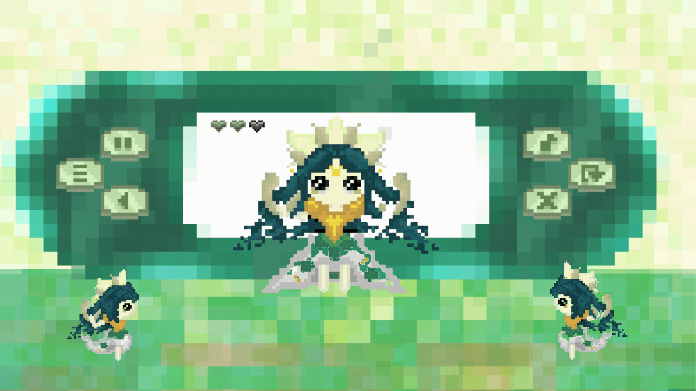

# She-ly
AR/XR &amp; AI Developer | Creative Software Dev | AWS Community Speaker

# ¡Hola, soy Shel 👋

🎮 **Software & XR Developer** | 👩‍🏫 Docente de Tecnología | 🎨 Creadora de experiencias inmersivas  

Me apasiona la convergencia entre **arte, videojuegos y tecnología**. Trabajo con **Realidad Aumentada, Inteligencia Artificial y Cloud (AWS)** para crear proyectos interactivos que inspiran, impactan y divierten.  

---

## 🚀 Lo que hago
- 🕹️ Desarrollo de videojuegos .  
- ✨ Experiencias inmersivas en **AR/VR/XR** (Meta Spark, Lens Studio, Unity, Hydra, Processing, Adaptive VR Learning).  
- ☁️ Charlas y talleres sobre **AI y AWS** (*Revolucionando la IA en Videojuegos con Amazon SageMaker*).  
- 👩‍🏫 Docente de programación y tecnología en **PILARES**, impulsando la educación tecnológica inclusiva.  

---

## 🏆 Logros destacados
- 🥇 *Soulsyn*: Judges’ Choice + 2º lugar LATAM.  
- 🥈 2º lugar en concursos de Realidad Aumentada e Inmersivos (Meta Spark).  
- 🎤 Speaker en **AWS Community Day, JsConf, Women in Gamex** y más.  

---

## 🛠️ Tecnologías

---

## 📌 Proyectos destacados
 Proyecto | Descripción | Demo |
|----------|-------------|------|
| 🎮 Eco Guardians of Olympus | RPG isométrico inspirado en FF1 |  |
| 🐾 AR para Veterinario | Filtro interactivo con Meta Spark |  |
| 🧠 Adaptive VR Learning | Experiencia que adapta el contenido según la actividad cerebral |  |
| 🌐 NARA AR | Proyecto educativo de AR accesible |  |
| 🎨 Hydra Live Coding | Taller creativo para principiantes en visuales interactivas |  |

---

## 📊 Stats
  

---

## 🌐 Encuéntrame en
- 💼 [LinkedIn](https://www.linkedin.com/in/joselyn-lagunas-5095b3232/)  
- 🌍 [Portafolio](#)  
- ✉️ josymonse@email.com  
